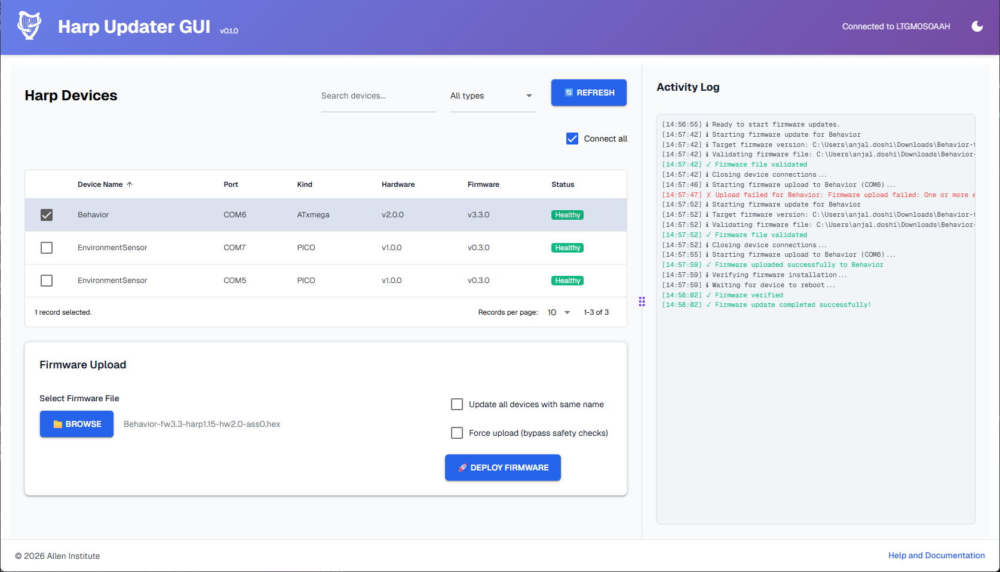

# Harp Firmware Updater GUI

Desktop GUI for updating Harp device firmware using the HarpRegulator CLI. The app is built with NiceGUI, runs in native window mode via `pywebview`, and includes an integrated device table + activity log workflow.

<picture>
  <source media="(prefers-color-scheme: dark)" srcset="docs/source/_static/app_screenshot_dark.png">
  <source media="(prefers-color-scheme: light)" srcset="docs/source/_static/app_screenshot_light.png">
  
</picture>

## Current Features

- Device discovery and refresh using `HarpRegulator list --json`
- Search, filter, and single-row selection in a sortable device table
- Firmware file selection (`.uf2` and `.hex`) with device-kind validation
- Single-device and same-name batch firmware deployment
- Force upload option for bypassing safety checks
- Real-time activity log with severity levels (info/success/warning/error/debug)
- Upload progress dialog and refresh dialog during long-running operations
- Light/dark mode toggle and custom themed styling

## Prerequisites

- Python `>=3.11,<4.0` (3.12 recommended)
- HarpRegulator CLI and dependencies (already included in the repository)
- Connected Harp devices

The app uses `HarpRegulator.exe` from PATH when available, otherwise the bundled
`deps/harp_regulator/win-x64` directory (or `_internal/harp_regulator/win-x64` in packaged builds).
An executable on PATH must support the same ATxmega validation and readiness behavior.

## Installation

This repository uses [uv](https://docs.astral.sh/uv/).

## Download pre-built binaries (recommended for end users)

If you do not want to install Python, download the packaged app from GitHub Releases:

1. Open: https://github.com/AllenNeuralDynamics/harp-updater-gui/releases
2. Download either:
  - Installer: `harp_updater_gui-installer-<tag>.exe` (recommended)
  - Portable zip: `harp_updater_gui-<tag>.zip`
3. If using the portable zip, right-click the zip → **Properties** → **Unblock** before extracting.
4. Extract the zip to a local folder (for example `C:\Apps\harp_updater_gui`).
5. Run `harp_updater_gui.exe`.

Installer notes:

- The installer automatically checks whether Microsoft .NET 8 Desktop Runtime (x64) is present.
- If missing, the installer downloads and installs the runtime during setup.
- Runtime installation may prompt for administrator/UAC approval.

> [!IMPORTANT]
> For the **portable zip** distribution, always click **Unblock** in file properties before extraction.
> If you skip this, Windows may propagate the "downloaded from internet" flag to extracted files and block `harp_updater_gui.exe` or bundled dependencies.

Notes:

- Keep `harp_updater_gui.exe` and `_internal` in the same folder structure after extraction.
- If using the portable zip, install Microsoft .NET 8 Desktop Runtime (x64): https://dotnet.microsoft.com/en-us/download/dotnet/8.0/runtime/desktop
- If Windows SmartScreen appears, click **More info** → **Run anyway** (only if the source is trusted).
- If native window mode fails to open, see Troubleshooting below.

### 1) Install uv

**Windows (PowerShell):**
```powershell
powershell -ExecutionPolicy ByPass -c "irm https://astral.sh/uv/install.ps1 | iex"
```

**macOS/Linux:**
```bash
curl -LsSf https://astral.sh/uv/install.sh | sh
```

### 2) Install dependencies

```bash
cd harp-updater-gui
uv sync
```

HarpRegulator and its dependencies are already shipped in `deps/harp_regulator/win-x64`.
Release builds package this directory as-is; no regulator source checkout or rebuild is required.
Keep the complete directory, including `Harp.Toolkit.Core.dll`, Bonsai dependencies,
and native libraries, rather than copying only the executable.

## Run

If you installed from a release binary, launch `harp_updater_gui.exe`.

If you are running from source:

```bash
uv run harp-updater-gui
```

Alternative:

```bash
uv run python run.py
```

Runtime configuration in `ui.run(...)` (see `src/harp_updater_gui/main.py`):
- `native=True`
- `port=4277`
- `reload=False`

## User Workflow

1. Click **Refresh** to discover devices.
2. Select a device row.
3. Browse and select a firmware file.
4. Optionally enable **Update all devices with same name**.
5. Click **Deploy Firmware**.
6. Monitor progress in the activity log and dialogs.

### ATxmega firmware updates

Intel HEX metadata comes from the original filename, not the image contents. Use
`<device>-fw<firmware>-harp<core>-hw<hardware>-ass<assembly>.hex`, for example
`Behavior-fw3.3-harp1.15-hw2.0-ass0.hex`. Versions have two components; hardware
and assembly accept `x` wildcards, and preview builds may append `-preview<number>`.
Generic filenames such as `firmware.hex` are rejected, even with Force upload enabled.

Before flashing, the GUI runs the regulator with `--no-upload` to validate metadata
and HEX checksums without connecting to a device. This check runs again on every
deployment, including forced uploads. Toolkit then checks the device name and hardware
compatibility before resetting the device.

ATxmega uploads always restart the device (`--no-reboot` is not supported). Regulator
waits up to 20 seconds for a Harp response before reporting success. A readiness timeout
means firmware was written but the device did not respond, not that flashing succeeded.
Stage output and errors are retained in the activity log when the command returns.

Force upload skips device-name and hardware checks and can recover a device already
in bootloader mode. Use it only for an intentional compatibility override or recovery;
it does not bypass image validation. The GUI suggests it only when Regulator identifies
a pre-reset connection or compatibility failure, not after a write or readiness failure.

## Project Structure

```
harp-updater-gui/
├── src/
│   └── harp_updater_gui/
│       ├── main.py
│       ├── components/
│       │   ├── header.py
│       │   ├── device_table.py
│       │   └── update_workflow.py
│       ├── models/
│       │   ├── device.py
│       │   └── firmware.py
│       ├── services/
│       │   ├── cli_wrapper.py
│       │   ├── device_manager.py
│       │   └── firmware_service.py
│       ├── static/
│       │   └── styles.css
│       └── utils/
│           └── constants.py
├── tests/
│   ├── test_device_manager.py
│   └── test_firmware_service.py
├── run.py
├── pyproject.toml
├── QUICKSTART.md
├── IMPLEMENTATION.md
└── CSS_GUIDE.md
```

## Development

```bash
# Run tests
uv run pytest

# Lint
uv run ruff check .

# Format
uv run ruff format .
```

## Troubleshooting

### HarpRegulator executable issues
- Confirm the CLI runs from terminal: `HarpRegulator --help`
- If needed, update the executable path in `src/harp_updater_gui/main.py`

### No devices found
- Verify USB connection and cable quality
- On Windows, install drivers: `HarpRegulator install-drivers`
- Retry refresh with **Connect all** enabled

### Firmware file rejected
- Ensure file exists and extension is `.uf2` or `.hex`
- Pico devices require `.uf2`
- ATxmega devices require `.hex`

## Notes

- Firmware repository download flows are placeholders in `FirmwareService`.
- The app deliberately starts only when `__name__ == "__main__"` to avoid worker-process UI reinitialization on Windows.

## License

MIT. See `LICENSE`.